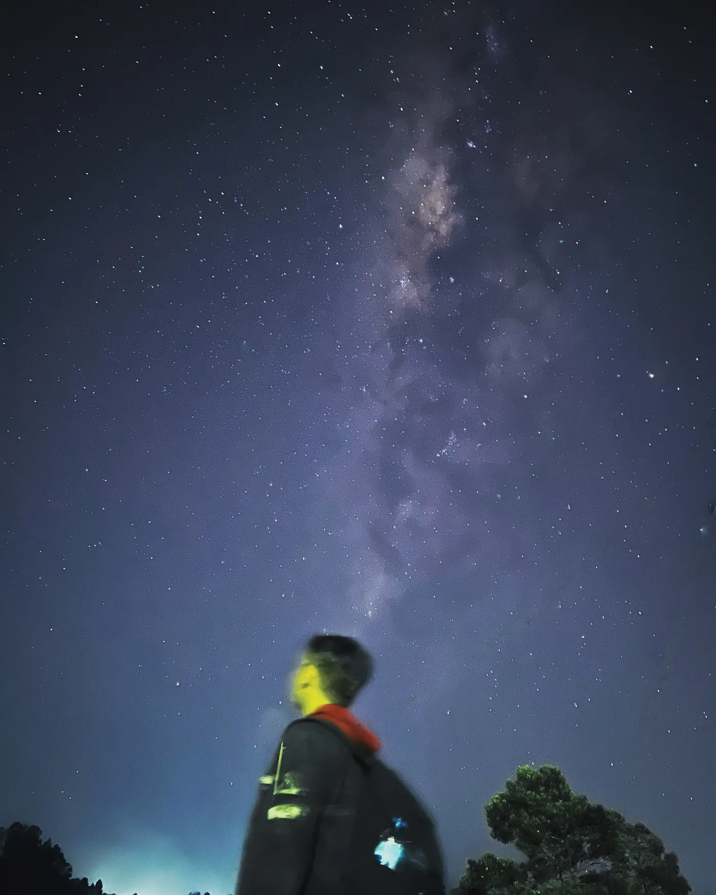

Since a while ago, he’s been blowing breaths onto his hands, as if trying to bring them back from the dead. 
The cold wind has forced him to make constant little movements to keep him from passing out of the cold. 

Dead cold hands, quivering shoulders, dry eyes, cold neck. Yet, still, he desperately keeps on trying to look up, hoping that the 
beautiful painting above will get burned into his eyes. For what he’s seeing is what his eyes has been craving.

There he was, standing under the billions of stars, eyes held hostage by the shooting stars, attention captivated by 
the majestic and graceful sight he’s been missing. 

It's been awhile. Since that night among the trees, he's been longing to
meet her again. The starry night he’s been dreaming of, the starry night he’s been yearning for.

Now he’s up above the clouds, above the mountains, under the embrace of that same celestial aurora. 
If you ask him right then and there, what super power would he choose if he were to be granted one, 
he would certainly answer: _the ability to stop time._

